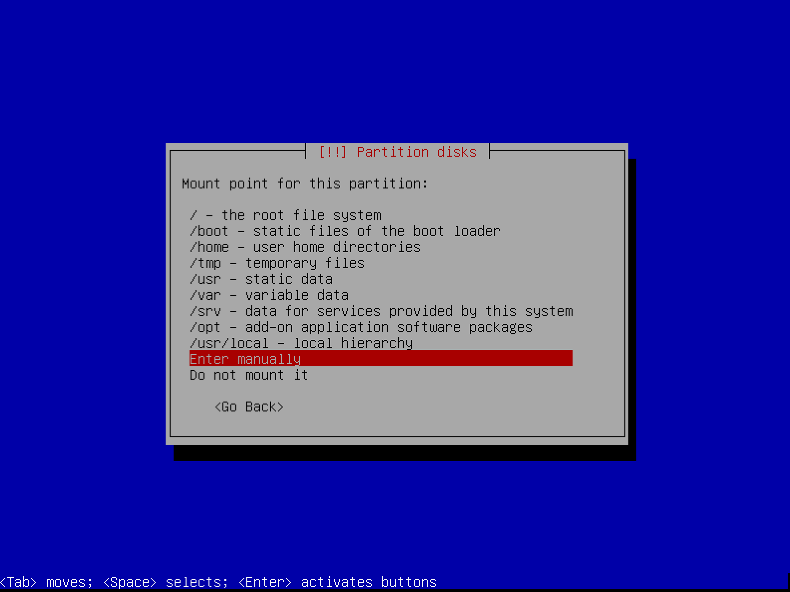
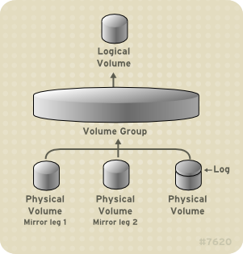

# Born2beRoot

---
### 가상화
---
하드웨어를 모방해서, 한 하드웨어 속에 다른 하드웨어가 또 있는 것 처럼 만드는 기술.
하이퍼바이저를 이용해서 만들 수 있다.
하이퍼바이저는 두가지 형태가 있는데, 하드웨어 위에 바로 하이퍼바이저가 설치되어 vm(virtual machine)을 관리하는 것 과, 하드웨어 - 운영체제 - 하이퍼바이저 - 가상화 머신 단계를 거치는 것이 있다.
전자는 데이터센터와 서버 기반 환경에서 많이 사용하고, 후자는 개인용 컴퓨터에서 여러 os를 사용할 때 많이 쓴다. (virtual box도 type2 하이퍼바이저 이다.)

이러한 가상화 기술은
- 다른 os를 사용하고 싶을 때
- 위험부담 없이 여러 실험을 하려고 할 때
- 하나의 하드웨어에 여러 가상 서버들을 설치하여 하드웨어 사용률을 올릴 때
사용한다.

---
### Debian vs CentOS
---
Debian

안정성이 높고 (서버에 좋다), 패키지들을 많이 포함하고 있다. 패키지를 설치할 때 자동으로 의존성을 찾아서 설치해준다. 유저층이 넓다. 개인이 만든 오픈소스 기반

CentOS

의존성 있는 패키지들을 유연성있게 처리하지 못함, 직접 의존성 조사를 해야한다. 기업용으로 만든 os의 무료버전.

---
### 1. virtual box setting
---
1. 사용할 os, 메모리를 설정한다.
2. 가상 하드디스크 설정을 하는데, 확장자마다 사용 가능한 범위가 다르다.
3. 가상 하드디스크 공간을 dynamically allocated 으로 하면, 데이터가 기록 될 때 자동으로 크기가 증가한다. 따라서 공간 낭비를 막을 수 있지만, 속도가 느려진다.

위 설정을 마치고 실행시키면,
1. 우선 사용할 운영체제의 iso파일(완전한 cd/dvd의 이미지)을 고른다.
2. 서버용으로 만든다고 상정하고 있기 때문에, 불필요한 gui환경을 추가하지 않는다. (graphical install 과 install으로 구분되어있음.)
3. hostname(가상머신의 이름) 설정.
4. root 비밀번호 설정 (생략가능)
5. 새 사용자 이름/비밀번호 설정

---
### 2. partitioning
---
저장 영역을 여러개로 분리하는 것. 실사용 데이터와 백업용 데이터를 나눠서 저장하는 등 여러 목적으로 사용 가능하다.
각 파티션에 대한 정보는 디스크의 파티션 테이블에 저장되고, 운영체제에서 디스크를 읽을 때 이 테이블을 먼저 읽는다.
운영체제는 이 파티션들을 마치 독립된 장치처럼 인식한다.
디스크는 발견 순 으로 sda, sdb...
파티션은 sda1, sda2...(논리 파티션은 sda5부터.)

---
암호화된 파티션을 보너스의 파티션 형태에 맞춰서 생성한다. (sda2는 직접 데이터를 저장하지 않고, 논리 파티션들의 저장소로 활용되는 확장 파티션 이다. 자동으로 생김.)
1. manual 모드로 들어간다.
2. SCSI2 sda로 진행한다. (ip망을 통한 전송은 필요 없기 때문. SCSI는 주변기기를 직렬로 연결하기 위한 표준을 말한다.small computer system interface)

---
마운트 : 하드웨어 장치들을 사용하기 위해 운영체제에 인식시키는 작업. 특정 디렉토리에 연결해야 한다 => 마운트 포인트 
마운트 포인트 : 리눅스 운영체제에서 사용하고자 하는 장치들을 인식시키기 위한 디렉토리
             파티션도 장치처럼 지정해서 사용 가능하다.

*swap : ram이 부족할 때 사용하는 디스크상의 공간

---
3. 파티션 만들기를 선택하고, 각 파티션의 용도에 맞게 설정을 해 준다.
    - 주 파티션 (부팅을 할 수 있는 기본 파티션, 디스크당 4개씩 생성 가능하다.) - 시작위치 (sda1) - 마운트 포인트 boot
4. 나머지 공간을 LVM으로 관리하도록 설정한다.
5. 논리 파티션으로 만들기 위해, VG를 생성한다.
6. VG에서 파티션을 생성한다.

*볼륨 : 컴퓨터가 인식할 수 있는 파일시스템을 사용하여 접근할 수 있는 저장 영역

---
LVM(logical volume manager) 개요

https://access.redhat.com/documentation/ko-kr/red_hat_enterprise_linux/5/html/logical_volume_manager_administration/lvm_overview

https://en.wikipedia.org/wiki/Logical_Volume_Manager_(Linux)

논리 볼륨 : 스토리지를 가상화 시켜 물리 디스크 크기에 제한을 두지 않을 수 있게 한다. 다음과 같은 이점이 있다.

    - 유연한 용량 : 디스크/파티션을 단일 논리 볼륨으로 묶어 여러 디스크에 걸쳐 파일 시스템 (https://ko.wikipedia.org/wiki/파일_시스템)을 확장할 수 있다.
    - 크기 조정 가능한 스토리지 풀 : 기존 디스크 장치를 다시 포맷하거나 파티셔닝 할 필요 없이, 간단하게 논리 볼륨 크기를 늘리거나 줄일 수 있다.
    - 장치 이름의 자유성 : 논리 볼륨은 사용자가 정의한 그룹에서 관리되기 때문에, 이름을 자유롭게 지을 수 있다.
    - 디스크 스트라이핑 : 두 개 이상의 디스크에 걸쳐 데이터를 스트라이핑하는 논리 볼륨을 생성할 수 있다. 데이터 처리량이 급격히 상승하는 효과가 있다.
    - 미러 볼륨 : 데이터에 미러를 쉽게 설정한다. (별개의 물리 뷸륨에 데이터의 사본을 저장해서, 문제가 생겼을 때 사용 가능하게 한다.)
    - 볼륨 스냅샷 : 실제 데이터에 영향을 미치지 않고 변경 효과를 테스트할 수 있다. (저장한 지점에서 변하지 않는다. 미러 볼륨은 원본과 계속 동기화된다는 차이가 있다.)

---
LVM 아키텍쳐

1. 기본 물리 스토리지 단위는 파티션/디스크 이다. 이를 LVM 물리 볼륨으로(PV) 초기화 한다.
2. 초기화 한 물리 볼륨을 볼륨 그룹으로(VG) 통합한다.
3. VG에서 각각의 논리 볼륨을(LV) 생성한다. 

---
### 3. User
---
- lslogins : 시스템의 전체 사용자 정보가 나온다.
- su - : root로 이동
- 
---
##### group
---
- cat /etc/group : 현존하는 그룹 목록 확인.
- sudo groupadd (groupname) : (groupname)그룹을 만든다.
- id (username) : (username)의 정보를 가져온다. (그룹도 볼 수 있다. -g옵션으로 그룹만 볼 수 있다.)
- sudo usermod -G (group1), (group2) (username) : (username)을 (group1)과 (group2)에 속하게 한다.
