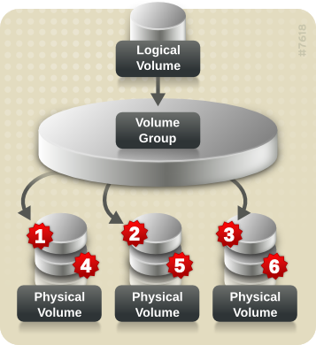

# Born2beRoot

---
### 가상화
---
하드웨어를 모방해서, 한 하드웨어 속에 다른 하드웨어가 또 있는 것 처럼 만드는 기술.
하이퍼바이저를 이용해서 만들 수 있다.
하이퍼바이저는 두가지 형태가 있는데, 하드웨어 위에 바로 하이퍼바이저가 설치되어 vm(virtual machine)을 관리하는 것 과, 하드웨어 - 운영체제 - 하이퍼바이저 - 가상화 머신 단계를 거치는 것이 있다.
전자는 데이터센터와 서버 기반 환경에서 많이 사용하고, 후자는 개인용 컴퓨터에서 여러 os를 사용할 때 많이 쓴다. (virtual box도 type2 하이퍼바이저 이다.)

이러한 가상화 기술은
- 다른 os를 사용하고 싶을 때
- 위험부담 없이 여러 실험을 하려고 할 때
- 하나의 하드웨어에 여러 가상 서버들을 설치하여 하드웨어 사용률을 올릴 때
사용한다.

---
### Debian vs CentOS
---
Debian

패키지를 설치할 때 자동으로 의존성을 찾아서 설치해준다. 유저층이 넓다. 개인이 만든 오픈소스 기반

CentOS

의존성 있는 패키지들을 유연성있게 처리하지 못함, 직접 의존성 조사를 해야한다.  기업용으로 만든 os의 무료버전.(https://m.blog.naver.com/zozokjs/221212381840)

---
### aptitude vs apt
---
- aptitude : highlevel => 기능이 더 많다, 유저 친화적이다.의도치 않은 동작을 자동으로 할 수도 있다.// apt : lowlevel. highlevel에서 쓸 수 있다.

---
### 1. virtual box setting
---
1. 사용할 os, 메모리를 설정한다.
2. 가상 하드디스크 설정을 하는데, 확장자마다 사용 가능한 툴이 다르다.
3. 가상 하드디스크 공간을 dynamically allocated 으로 하면, 데이터가 기록 될 때 자동으로 크기가 증가한다. 따라서 공간 낭비를 막을 수 있지만, 속도가 느려진다.

위 설정을 마치고 실행시키면,
1. 우선 사용할 운영체제의 iso파일(완전한 cd/dvd의 이미지)을 고른다.
2. 서버용으로 만든다고 상정하고 있기 때문에, 불필요한 gui환경을 추가하지 않는다. (graphical install 과 install으로 구분되어있음.)
3. hostname(가상머신의 이름) 설정.
4. root 비밀번호 설정 (생략가능)
5. 새 사용자 이름/비밀번호 설정

---
### 2. partitioning
---
저장 영역을 여러개로 분리하는 것. 실사용 데이터와 백업용 데이터를 나눠서 저장하는 등 여러 목적으로 사용 가능하다.
각 파티션에 대한 정보는 디스크의 파티션 테이블에 저장되고, 운영체제에서 디스크를 읽을 때 이 테이블을 먼저 읽는다.
운영체제는 이 파티션들을 마치 독립된 장치처럼 인식한다.
디스크는 발견 순 으로 sda, sdb...
파티션은 sda1, sda2...(논리 파티션은 sda5부터.)

---
암호화된 파티션을 보너스의 파티션 형태에 맞춰서 생성한다. (sda2는 직접 데이터를 저장하지 않고, 논리 파티션들의 저장소로 활용되는 확장 파티션 이다. 자동으로 생김.)
1. manual 모드로 들어간다.
2. SCSI2 sda로 진행한다. (SCSI는 주변기기를 직렬로 연결하기 위한 표준을 말한다.small computer system interface)

---
마운트 : 하드웨어 장치들을 사용하기 위해 운영체제에 인식시키는 작업. 특정 디렉토리에 연결해야 한다 => 마운트 포인트 
마운트 포인트 : 리눅스 운영체제에서 사용하고자 하는 장치들을 인식시키기 위한 디렉토리
             파티션도 장치처럼 지정해서 사용 가능하다.

*swap : ram이 부족할 때 사용하는 디스크상의 공간

---
3. 파티션 만들기를 선택하고, 각 파티션의 용도에 맞게 설정을 해 준다.
    - 주 파티션 (부팅을 할 수 있는 기본 파티션, 디스크당 4개씩 생성 가능하다.) - 시작위치 (sda1) - 마운트 포인트 boot
4. 나머지 공간을 LVM으로 관리하도록 설정한다.
5. 논리 파티션으로 만들기 위해, VG를 생성한다.
6. VG에서 파티션을 생성한다.
7. lsblk로 확인한다. (https://linuxconfig.org/introduction-to-the-lsblk-command)

*볼륨 : 컴퓨터가 인식할 수 있는 파일시스템을 사용하여 접근할 수 있는 저장 영역

---
LVM(logical volume manager) 개요

https://access.redhat.com/documentation/ko-kr/red_hat_enterprise_linux/5/html/logical_volume_manager_administration/lvm_overview

https://en.wikipedia.org/wiki/Logical_Volume_Manager_(Linux)

논리 볼륨 : 스토리지를 가상화 시켜 물리 디스크 크기에 제한을 두지 않을 수 있게 한다. 다음과 같은 이점이 있다.

    - 유연한 용량 : 디스크/파티션을 단일 논리 볼륨으로 묶어 여러 디스크에 걸쳐 파일 시스템 (https://ko.wikipedia.org/wiki/파일_시스템)을 확장할 수 있다.
    - 크기 조정 가능한 스토리지 풀 : 기존 디스크 장치를 다시 포맷하거나 파티셔닝 할 필요 없이, 간단하게 논리 볼륨 크기를 늘리거나 줄일 수 있다.
    - 장치 이름의 자유성 : 논리 볼륨은 사용자가 정의한 그룹에서 관리되기 때문에, 이름을 자유롭게 지을 수 있다.
    - 디스크 스트라이핑 : 두 개 이상의 디스크에 걸쳐 데이터를 스트라이핑하는 논리 볼륨을 생성할 수 있다. 데이터 처리량이 급격히 상승하는 효과가 있다.
    - 미러 볼륨 : 데이터에 미러를 쉽게 설정한다. (별개의 물리 뷸륨에 데이터의 사본을 저장해서, 문제가 생겼을 때 사용 가능하게 한다.)
    - 볼륨 스냅샷 : 실제 데이터에 영향을 미치지 않고 변경 효과를 테스트할 수 있다. (저장한 지점에서 변하지 않는다. 미러 볼륨은 원본과 계속 동기화된다는 차이가 있다.)

---
LVM 아키텍쳐

1. 기본 물리 스토리지 단위는 파티션/디스크 이다. 이를 LVM 물리 볼륨으로(PV) 초기화 한다.
2. 초기화 한 물리 볼륨을 볼륨 그룹으로(VG) 통합한다.
3. VG에서 각각의 논리 볼륨을(LV) 생성한다. 

---
### 3. sudo
---
- sudo : 유닉스(https://ko.wikipedia.org/wiki/%EC%9C%A0%EB%8B%89%EC%8A%A4) 계열 os에서 다른 사용자의 보안권한, 관리자로서 프로그램을 구동할 수 있도록 하는 프로그램.
- su, su -, sudo : 다른 계정으로 전환, 환경변수 적용 X / root 계정으로 전환, 환경변수 적용 / root가 아닌 사용자가 root권한 빌림
- 한 터미널에서 한번만 비밀번호(현 사용자의 비밀번호. 인증 후 해당 사용자가 sudo그룹인지 확인함.)를 입력하면 된다.
- tty : 터미널을 의미한다. 직접 연결된 모니터, 키보드를 사용하는 것.(https://www.howtogeek.com/428174/what-is-a-tty-on-linux-and-how-to-use-the-tty-command/)
- dpkg(debian 패키지 관리 시스템) -l sudo : sudo 설치여부 확인
- apt-get install sudo : sudo 설치
- mkdir /var/log/sudo : sudo log 저장
- visudo : sudo 설정파일(sudoers)을 편집한다. (/etc/sudoers 파일은 쓰기 권한이 기본적으로 없는데, 이 권한을 부여하면 vi등으로 수정 가능하지만 보안 문제가 생긴다.)
  - secure_path : sudo 실행할 경로. 콜론으로 구분한다. (usr : 시스템이 아닌 사용자가 실행할 프로그램들이 저장되는 경로. 예시의 경로는 user command binaries, systemp command binaries를 말함. ex. cat, chmod / halt reboot)
  - authfail_message : 인증 실패 시 출력할 메세지
  - badpass_message : 비밀번호를 틀렸을 때 출력할 메세지
  - log_input : sudo 실행 시 입력된 명령어를 저장하겠다는 설정
  - log_output : sudo 실행 시 출력 결과를 저장하겠다는 설정
  - iolog_dir : log 저장 디렉토리
  - requiretty : tty를 사용하게 하는 설정
  - passwd_tries : 패스워드 입력 시도 횟수 결정
---
위 설정을 확인하는 방법
- sudo (명령 : echo, cat, ifconfig...) 으로 비밀번호가 틀릴 때, 3회 잘못 입력했을 때 확인.
- crontab에서 sudo명령 실행시켜보기
- /var/log/sudo 폴더 확인

---
### 4. Apparmor
---
- kdump : 운영체제에서 치명적 오류가 발생할 때 당시 상태를 기록하는 커널의 한 부분. (https://blog.osci.kr/1)
- SELinux : 관리자가 시스템 액세스 권한을 효과적으로 제어할 수 있게 하는 리눅스용 보안 아키텍쳐. (https://www.redhat.com/ko/topics/linux/what-is-selinux)
- AppArmor : 데비안에서 SELinux 대용으로 사용한다.
    - 프로그램의 프로필을 통해 작업들을 제한 / 관리한다.
        - 네트워크 액세스
        - [raw 소켓](https://ko.wikipedia.org/wiki/Raw_소켓)(패킷을 직접적으로 주고 받게 해주는 인터넷 소켓) 액세스
        - 파일 읽기, 쓰기, 실행 권한
        - 기타 해당 프로그램이 취할 수 있는 작업
    - MAC을 제공함으로써 전통적인 유닉스의 DAC를 지원
    - 오직 정책 파일 기반으로 작동한다.
    - 프로필은 /etc/apparmor.d 에 저장된다.
    - enforce mode : 응용프로그램이 제한된 동작을 수행하지 못하게 한다.
    - compain mode : 응용프로그램을 제한하지 않고, 위반 사항을 보고하는 로그만을 만든다.
- MAC(mandatory access contorl) : 강제 접근 제어. 정의된 정책을 활용해 사용자와 프로세스의 행동을 제어한다.(https://www.lesstif.com/ws/access-control-dac-mac-43843837.html)
- DAC(discretionary access control) : 임의 접근 제어. 소유자가 사용자 또는 그룹이 자원에 접근하는 것을 조절한다.
- apparmor_status : 활성화 여부를 확인 가능하다.

---
### 5. hostname
---
hostname : 장치에 부여되는 고유한 이름. hostnamectl로 확인 가능하다.
/etc/hostname, /etc/hosts를 편집하면 된다.

---
### 6. user
---
- lslogins : 전체 사용자 확인
- adduser : user 추가
- deluser : user 제거

##### group
- cat /etc/group : 현존하는 그룹 목록 확인.
- sudo groupadd (groupname) : (groupname)그룹을 만든다.
- sudo groupdel (groupname) : 그룹을 삭제한다. 단, 그룹에 사용자가 없어야 함.
- id (username) : (username)의 정보를 가져온다. (그룹도 볼 수 있다. -Gn옵션으로 그룹만 볼 수 있다.)
- sudo usermod -G (group1),(group2) (username) : (username)을 (group1)과 (group2)에 속하게 한다.

##### passwd
- /etc/login.defs 에서 변경한다.
- PASS_MAX_DAYS : 비밀번호 만료 기간
- PASS_MIN_DAYS : 비밀번호 변경까지의 최소 기간
- PASS_WARN_AGE : 비밀번호 만료 경고까지 기간

- 추가적인 정책 설정을 위해 패키지를 설치한다. (sudo apt install libpam-pwdquality)
- /etc/pam.d/common-password 에서 pam_pwquality.so를 편집한다. 이때 양수(0포함)는 최대 n개, 음수는 최소 n개를 위미함.
- retry=3 : 비밀번호 입력 횟수.(최대 3회)
- minlen=10 : 비밀번호 최소 길이
- difok=7 : 이전 비밀번호와 달라야 하는 문자 수 (root는 기존 비밀번호를 따지지 않기 때문에 해당없음.)
- ucredit=-1 : 대문자 제한(최소 한 글자 이상)
- lcredit=-1 : 소문자 제한
- dcredit=-1 : 숫자 제한
- reject_username : 유저 이름이 그대로/거꾸로 비밀번호에 입력될 수 없음
- enforce_for_root : 해당 비밀번호 정책을 root에도 적용
- maxrepeat=3 : 중복 글자 제한(최대 3글자)

- 기존 유저에 대해 정책을 적용시키기 위해, passwd -e (username)으로 해당 정책을 적용시킨다. (다음 로그인 시 강제 변경) || passwd (user) - 비밀번호 변경
- 기존 유저에 대해 기간을 적용시키기 위해, chage -m 2 -M 30 -W 7 (username)으로 직접 설정한다. (vi /etc/shadow로 확인 가능하다.)

---
### 7. UFW(uncomplicated fire wall)
---
- 리눅스 환경에서 작동되는 방화벽 관리 프로그램. iptables(커널상에서의 패킷 필터링 기능을 사용자 공간에서 제어하는 수준으로 사용하게 해주는 방화벽 설정 도구)를 통해 구성한다.
- apt install ufw
- [예시 문법들](https://help.ubuntu.com/community/UFW)
- ufw allow/deny (port) : (port)번 포트를 허용/거부한다.
- ufw status : 상태를 확인한다.

---
### 8. SSH(secure shell protocol)
---
- systemctl status ssh
- 네트워크 프로토콜 중 하나로, 컴퓨터간에 인터넷을 통해 서로 통신할 때 안전하게 통신하기 위해 사용하는 프로토콜.
- 원격 접속을 이용하여 터미널 환경을 사용할 수 있도록 고안되어 있다. 대표적으로 git에서 사용한다.
- 암호화된 통신을 하기 때문에 매우 안전하다. 기존의 telnet은 암호화가 없어 보안이 매우 취약했다.

- apt install openssh-server
- /etc/ssh/sshd_config : ssh 설정 변경.
		- port 4242
		- PermitRootLogin no : root계정으로 ssh 통신 막기.
- virtual box에서 포트포워딩(어느 포트로 연결할지 정해주는 것).
- ssh -p 4242 (username)@(hostip) 로 접속

---
### 9. monitoring.sh
---

##### cron
- 유닉스 계열 컴퓨터 운영 체제의 시간 기반 잡 스케줄러.
- crontab -e로 수정할 수 있다.